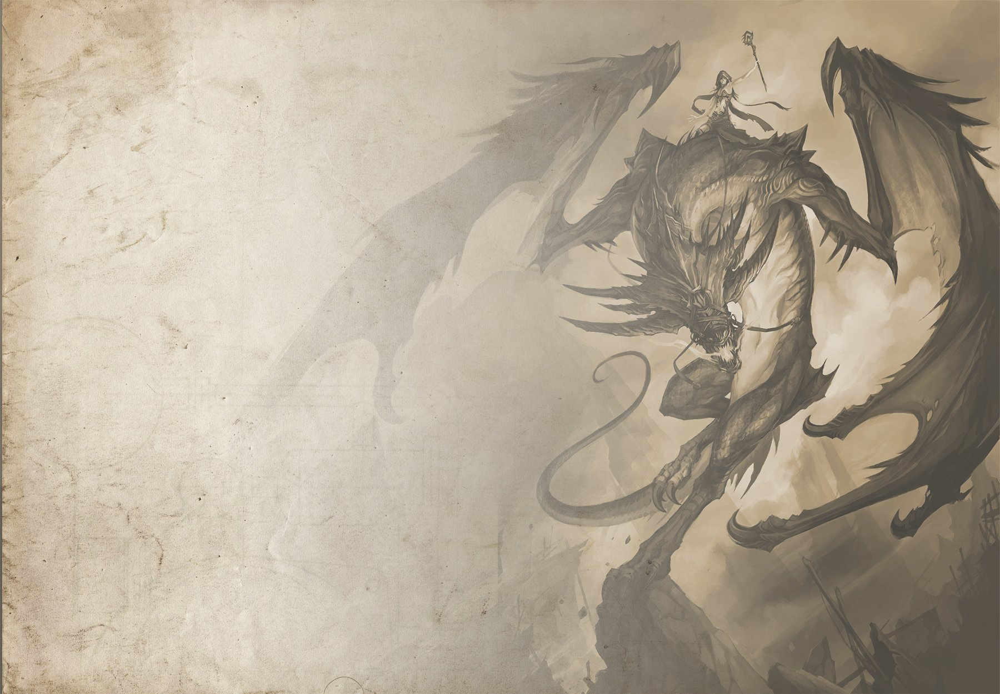

# Introduction

If you are reading this, you probably know who I am. I probably sent you this link in discord or something like that and you opened it thinking you would check it out. I honestly can't believe that you clicked on the blog section! There is a possibility that you don't know me. Maybe you stumbled onto this site randomly, and somehow had your interest peaked enough to open the first blog on this site and read first 84 words or so of it. Maybe you are a potential employer who saw the link to this site on a resume. If so, I am **extra** happy you are here.

If you don't know me, my name is Brooks Palin. I am a programmer. If you couldn't tell that from my home page, then I am a poor one. I am a lot of other things, however you will have to learn those by reading other blog posts.

Though this introduction has been fun, you didn't click on this post to read about me. You wanted to see how this blog works and the process of making it. Without Further ado, here is that!

# The Setup

## Header2

## Header2

# Header1

### Header3

#### Heading4

##### Heading5

###### Heading6




```rust
pub fn test() {
  println!("This is a test!")
}
```

> This is a test quote

Here is an update.

Yet another update!